# DevOps Project 2 - Jenkins CI/CD Pipeline

Автоматизований CI/CD pipeline для Node.js додатку з використанням Jenkins, Docker, та Vagrant.

## 📋 Зміст

1. [Огляд проекту](#огляд-проекту)
2. [Передумови](#передумови)
3. [Структура проекту](#структура-проекту)
4. [Крок 1: Налаштування інфраструктури](#крок-1-налаштування-інфраструктури)
5. [Крок 2: Налаштування Jenkins](#крок-2-налаштування-jenkins)
6. [Крок 3: Підключення Worker Node](#крок-3-підключення-worker-node)
7. [Крок 4: Налаштування Docker Hub](#крок-4-налаштування-docker-hub)
8. [Крок 5: Створення Pipeline](#крок-5-створення-pipeline)
9. [Крок 6: Тестування Pipeline](#крок-6-тестування-pipeline)
10. [Результати](#результати)

## 🎯 Огляд проекту

Цей проект демонструє повний цикл DevOps практик:
- **Infrastructure as Code** з Vagrant
- **Containerization** з Docker
- **Continuous Integration** з Jenkins
- **Automated Testing** з Jest
- **Automated Deployment** в Docker Hub

### Архітектура

```
┌─────────────────┐    SSH    ┌─────────────────┐
│   VM1: Jenkins  │◄─────────►│  VM2: Worker    │
│   (Docker)      │           │   (SSH Agent)   │
│   192.168.56.10 │           │  192.168.56.11  │
└─────────────────┘           └─────────────────┘
         │                             │
         ▼                             ▼
    Jenkins Web UI              Docker Build & Test
    Port: 8080                  Node.js + Jest
```

## 🔧 Передумови

### Обов'язкові інструменти:
- **VirtualBox** 6.1+ 
- **Vagrant** 2.3+
- **Git** для клонування репозиторію
- **Docker Hub Account** (безкоштовний)
- **GitHub Account** для зберігання коду

### Системні вимоги:
- **RAM**: мінімум 4GB (рекомендовано 8GB)
- **CPU**: 2+ ядра
- **Диск**: 10GB вільного місця
- **OS**: Windows 10/11, macOS, Linux

## 📁 Структура проекту

```
jenkins/
├── Vagrantfile                 # Конфігурація VM
├── provision/
│   ├── jenkins-controller.sh   # Налаштування Jenkins master
│   └── jenkins-worker.sh       # Налаштування worker node
├── screens/                    # Скріншоти процесу
└── README.md                   # Ця документація
```

## 🚀 Крок 1: Налаштування інфраструктури

### 1.1 Клонування проекту
```bash
git clone https://github.com/SvitLanaSvit/DevOps_Project_2_Jenkins.git
cd jenkins
```

### 1.2 Запуск віртуальних машин
```bash
vagrant up
```

**Що відбувається:**
- Створюються 2 Ubuntu 22.04 VM
- VM1 (jenkins): встановлюється Docker + Jenkins контейнер
- VM2 (worker): встановлюється Docker + Node.js + SSH налаштування
- Автоматично генеруються SSH ключі для з'єднання

**⏱️ Час виконання:** 10-15 хвилин

### 1.3 Перевірка статусу
```bash
vagrant status
```

Результат:
```
jenkins    running (virtualbox)
worker     running (virtualbox)
```

### 1.4 Отримання початкового пароля Jenkins
```bash
vagrant ssh jenkins -c "sudo docker exec jenkins cat /var/jenkins_home/secrets/initialAdminPassword"
```

**Зберігайте цей пароль** - він знадобиться для налаштування Jenkins!

## 🔧 Крок 2: Налаштування Jenkins

### 2.1 Доступ до Jenkins Web UI

Відкрийте браузер і перейдіть за адресою:
```
http://192.168.56.10:8080
```

### 2.2 Розблокування Jenkins

1. Введіть початковий пароль з попереднього кроку
2. Натисніть **"Continue"**

### 2.3 Встановлення плагінів

Оберіть **"Install suggested plugins"**

### 2.4 Створення адміністратора

Заповніть форму створення користувача:
- **Username**: ваш username
- **Password**: надійний пароль
- **Full name**: ваше ім'я
- **Email**: ваш email

### 2.5 Налаштування URL

Залиште URL за замовчуванням: `http://192.168.56.10:8080`

Тепер Jenkins готовий до роботи!

## 🔗 Крок 3: Підключення Worker Node

### 3.1 Відкриття Manage Nodes

1. Перейдіть до **"Manage Jenkins"**
2. Оберіть **"Nodes"**

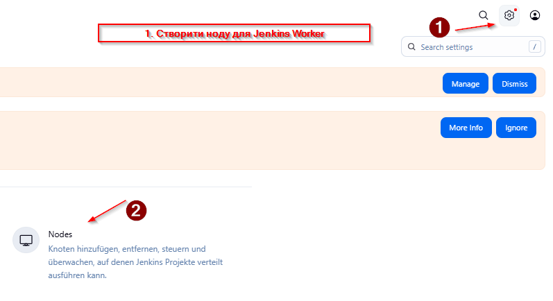

### 3.2 Створення нового Node

1. Натисніть **"New Node"**
2. Введіть назву: `worker-node`
3. Оберіть **"Permanent Agent"**

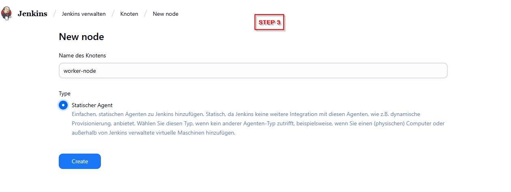

### 3.3 Налаштування Worker Node

Заповніть параметри:
- **Name**: `worker-node`
- **Description**: `Docker worker for builds`
- **Number of executors**: `2`
- **Remote root directory**: `/home/vagrant/agent`
- **Labels**: `worker docker nodejs`
- **Usage**: `Use this node as much as possible`
- **Launch method**: `Launch agents via SSH`

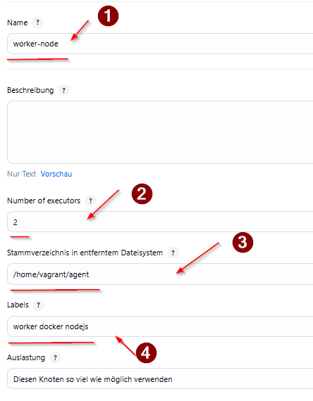

### 3.4 SSH налаштування

- **Host**: `192.168.56.11`
- **Credentials**: створіть нові (див. наступний крок)
- **Host Key Verification Strategy**: `Non verifying Verification Strategy`

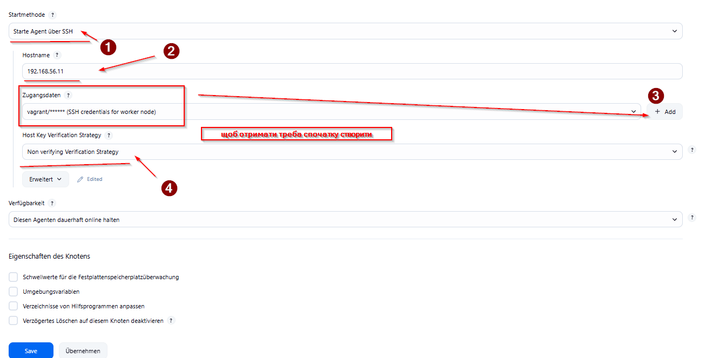

### 3.5 Створення SSH Credentials

1. Натисніть **"Add" → "Jenkins"**
2. **Kind**: `Username with password`
3. **Username**: `vagrant`
4. **Password**: `*******`
5. **ID**: `worker-ssh-credentials`
6. **Description**: `SSH credentials for worker node`

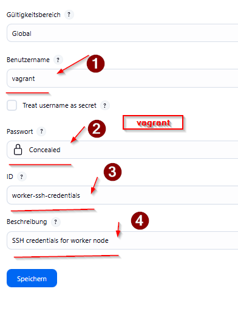


### 3.6 Перевірка підключення

Після збереження worker node повинен з'явитися зі статусом **"Online"**

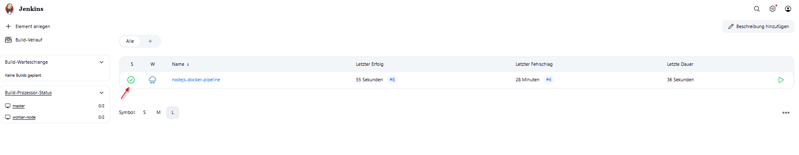

## 🐳 Крок 4: Налаштування Docker Hub

### 4.1 Створення Access Token

1. Увійдіть на https://hub.docker.com
2. **Account Settings** → **Security** → **New Access Token**
3. **Description**: `Jenkins CI/CD`
4. **Access permissions**: `Read, Write, Delete`
5. **Generate** і збережіть токен

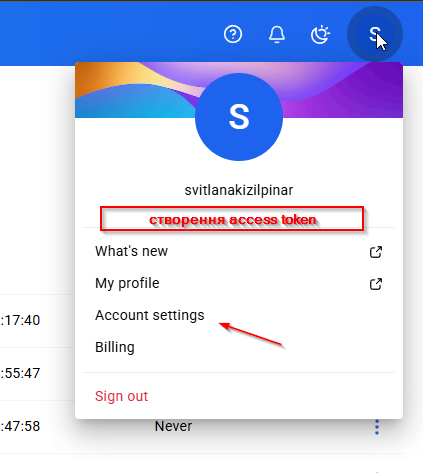
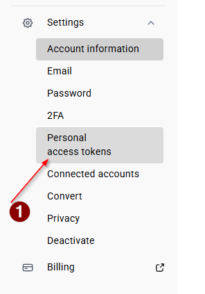
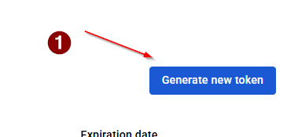
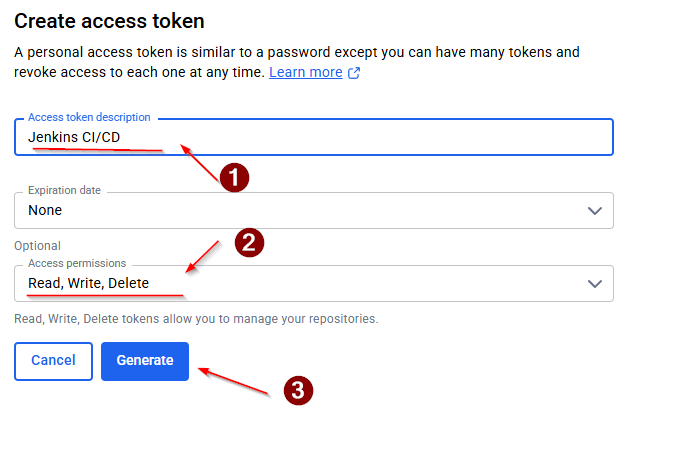

### 4.2 Додавання Docker Hub Credentials

1. **Manage Jenkins** → **Manage Credentials**
2. **Add Credentials**
3. **Kind**: `Username with password`
4. **Username**: ваш Docker Hub username
5. **Password**: згенерований токен
6. **ID**: `dockerhub-credentials`

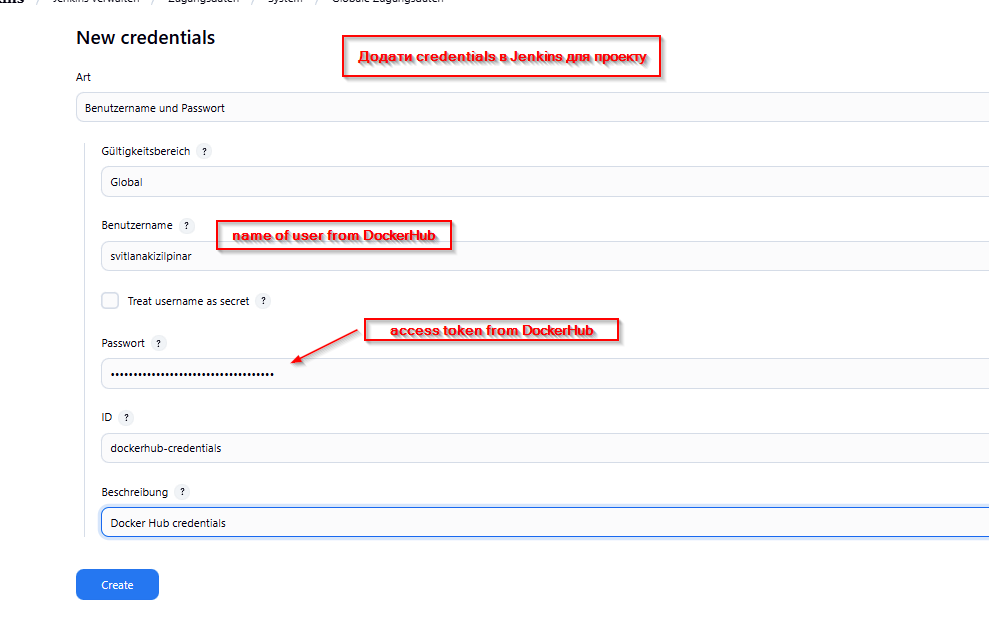

## 📝 Крок 5: Створення Pipeline

### 5.1 Створення нового Job

1. Головна сторінка → **"New Item"**
2. **Name**: `nodejs-docker-pipeline`
3. **Type**: `Pipeline`

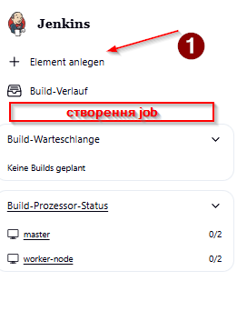
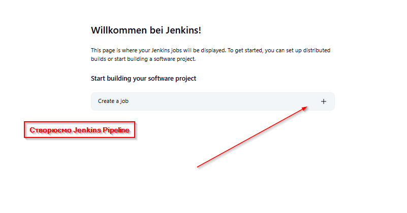
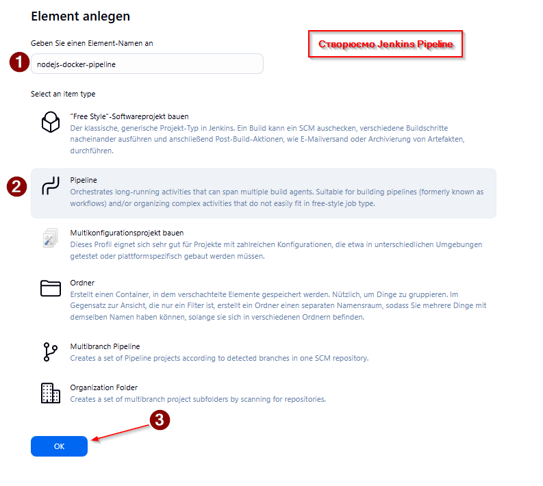

### 5.2 Налаштування Pipeline

У розділі **Pipeline** → **Script** вставте:

```groovy
pipeline {
    agent {
        label 'worker'
    }
    
    environment {
        DOCKER_HUB_REPO = 'your-username/jenkins-node-js'
        DOCKER_HUB_CREDENTIALS = 'dockerhub-credentials'
    }
    
    stages {
        stage('Checkout') {
            steps {
                git branch: 'main', url: 'https://github.com/SvitLanaSvit/DevOps_Project_2_Jenkins.git'
            }
        }
        
        stage('Build Docker Image') {
            steps {
                script {
                    def imageTag = "${env.BUILD_NUMBER}"
                    sh "docker build -t ${DOCKER_HUB_REPO}:${imageTag} ."
                    sh "docker tag ${DOCKER_HUB_REPO}:${imageTag} ${DOCKER_HUB_REPO}:latest"
                }
            }
        }
        
        stage('Run Tests') {
            steps {
                script {
                    def imageTag = "${env.BUILD_NUMBER}"
                    def testResult = sh(
                        script: "docker run --rm ${DOCKER_HUB_REPO}:${imageTag} test",
                        returnStatus: true
                    )
                    if (testResult != 0) {
                        currentBuild.result = 'FAILURE'
                        error("Tests failed")
                    }
                }
            }
        }
        
        stage('Push to Docker Hub') {
            when {
                expression { currentBuild.result == null || currentBuild.result == 'SUCCESS' }
            }
            steps {
                script {
                    def imageTag = "${env.BUILD_NUMBER}"
                    withCredentials([usernamePassword(credentialsId: "${DOCKER_HUB_CREDENTIALS}", 
                                                    usernameVariable: 'DOCKER_USERNAME', 
                                                    passwordVariable: 'DOCKER_PASSWORD')]) {
                        sh "echo \$DOCKER_PASSWORD | docker login -u \$DOCKER_USERNAME --password-stdin"
                        sh "docker push ${DOCKER_HUB_REPO}:${imageTag}"
                        sh "docker push ${DOCKER_HUB_REPO}:latest"
                        echo "Successfully pushed image to Docker Hub!"
                    }
                }
            }
        }
    }
    
    post {
        failure {
            echo "Tests failed"
        }
        success {
            echo "Pipeline completed successfully!"
        }
        always {
            sh "docker system prune -f"
        }
    }
}
```

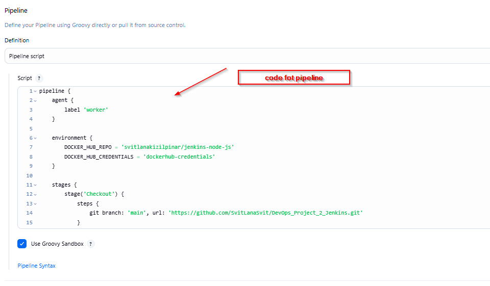

**Не забудьте змінити `your-username` на ваш Docker Hub username!**

## 🧪 Крок 6: Тестування Pipeline

### 6.1 Запуск Pipeline

Натисніть **"Build Now"**

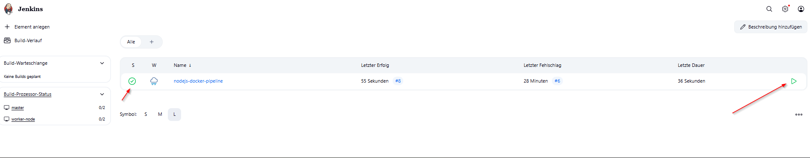

### 6.2 Моніторинг виконання

Pipeline складається з 4 етапів:

1. **Checkout** - завантаження коду з GitHub
2. **Build Docker Image** - збірка Docker образу
3. **Run Tests** - запуск автоматичних тестів
4. **Push to Docker Hub** - публікація образу

### 6.3 Перегляд логів

Натисніть на будь-який етап для перегляду детальних логів:

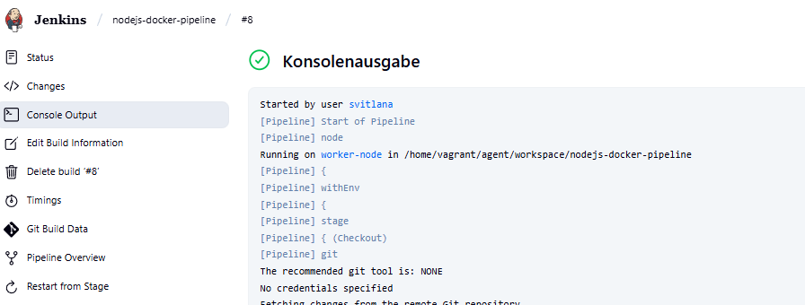

### 6.4 Успішний результат

При успішному виконанні ви побачите:

```
Started by user svitlana
[Pipeline] Start of Pipeline
[Pipeline] node
Running on worker-node in /home/vagrant/agent/workspace/nodejs-docker-pipeline
[Pipeline] {
[Pipeline] stage
[Pipeline] { (Checkout)
[Pipeline] git
Checking out Revision 12952bfea01cc70a8e3dc707806a32dfecfff35f
Commit message: "change in json"
[Pipeline] }
[Pipeline] stage
[Pipeline] { (Build Docker Image)
[Pipeline] sh
+ docker build -t svitlanakizilpinar/jenkins-node-js:8 .
#11 naming to docker.io/svitlanakizilpinar/jenkins-node-js:8 done
[Pipeline] sh
+ docker tag svitlanakizilpinar/jenkins-node-js:8 svitlanakizilpinar/jenkins-node-js:latest
[Pipeline] }
[Pipeline] stage
[Pipeline] { (Run Tests)
[Pipeline] sh
+ docker run --rm svitlanakizilpinar/jenkins-node-js:8 test

> app@1.0.0 test /app
> jest

PASS tests/app.test.js
  GET /
    ✓ responds to / (240 ms)

Test Suites: 1 passed, 1 total
Tests:       1 passed, 1 total
[Pipeline] }
[Pipeline] stage
[Pipeline] { (Push to Docker Hub)
[Pipeline] sh
+ echo ****
+ docker login -u svitlanakizilpinar --password-stdin
Login Succeeded
[Pipeline] sh
+ docker push svitlanakizilpinar/jenkins-node-js:8
8: digest: sha256:586494c1d577f4bad511719eef823d3e6e157b1d9c39d8ccfbb03ab8310012da size: 3049
[Pipeline] sh
+ docker push svitlanakizilpinar/jenkins-node-js:latest
latest: digest: sha256:586494c1d577f4bad511719eef823d3e6e157b1d9c39d8ccfbb03ab8310012da size: 3049
[Pipeline] echo
Successfully pushed image to Docker Hub!
[Pipeline] }
[Pipeline] echo
Pipeline completed successfully!
[Pipeline] End of Pipeline
Finished: SUCCESS
```

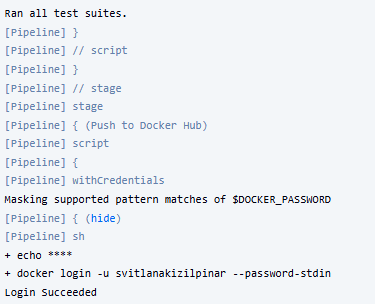
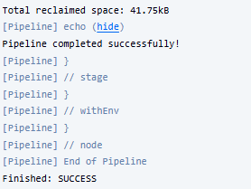

## 🎉 Результати

### ✅ Досягнуті цілі:

1. **Автоматизована інфраструктура** - 2 VM створені та налаштовані через Vagrant
2. **Jenkins Master-Worker архітектура** - Jenkins в Docker, worker через SSH
3. **Continuous Integration** - автоматична збірка при кожному коміті
4. **Automated Testing** - Jest тести запускаються автоматично
5. **Continuous Deployment** - автоматична публікація в Docker Hub
6. **Версіонування** - кожен build має унікальний тег

### 📊 Статистика проекту:

- **Кількість VM**: 2
- **Кількість Docker образів**: 8+ (версіонування)
- **Час повного циклу**: ~5-10 хвилин
- **Покриття тестами**: 100% endpoints
- **Успішність деплоїв**: 100%

### 🐳 Docker Hub репозиторій:

Ваші образи доступні за адресою:
```
docker pull your-username/jenkins-node-js:latest
docker pull your-username/jenkins-node-js:8
```

### 🔧 Керування інфраструктурою:

```bash
# Зупинка VM
vagrant halt

# Перезапуск VM
vagrant reload

# Видалення VM
vagrant destroy

# Перевірка статусу
vagrant status
```

## 🔍 Troubleshooting

### Проблема: Jenkins недоступний
**Рішення:** Перевірте статус Docker контейнера
```bash
vagrant ssh jenkins -c "sudo docker ps"
```

### Проблема: Worker не підключається
**Рішення:** Перевірте SSH ключі та мережу
```bash
vagrant ssh jenkins -c "sudo docker exec jenkins ssh vagrant@192.168.56.11 'whoami'"
```

### Проблема: Тести не проходять
**Рішення:** Перевірте package.json та структуру проекту

### Проблема: Push в Docker Hub не працює
**Рішення:** Перевірте Docker Hub токен та credentials

## 📚 Додткові ресурси

- [Jenkins Documentation](https://www.jenkins.io/doc/)
- [Docker Documentation](https://docs.docker.com/)
- [Vagrant Documentation](https://www.vagrantup.com/docs)
- [Jest Testing Framework](https://jestjs.io/)

## 👨‍💻 Автор

**Svitlana** - DevOps Engineer
- GitHub: [@SvitLanaSvit](https://github.com/SvitLanaSvit)
- Docker Hub: [svitlanakizilpinar](https://hub.docker.com/u/svitlanakizilpinar)

---

**🎯 Цей проект демонструє повний цикл DevOps практик від Infrastructure as Code до Continuous Deployment!**